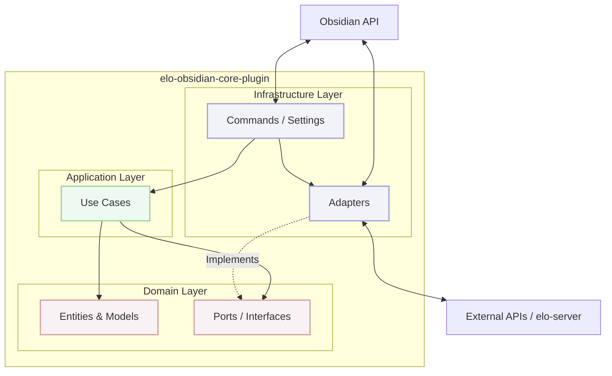

# Elo Obsidian Core Plugin

## Overview

The `elo-obsidian-core-plugin` is the central bridge connecting the user's local Obsidian Vault with the broader Elocuency framework (principally `elo-server`). Rather than just another plugin, it acts as a robust infrastructure layer enabling secure AI interactions, deep context extraction, and advanced note management.

This plugin serves as the foundational dependency for more specialized Elocuency micro-plugins (like Spotify or YouTube integrations), sharing core functionalities and reducing redundant logic across the ecosystem.

## Architecture

This plugin strictly adheres to **SOLID principles** and **Hexagonal Architecture** (Ports and Adapters) as defined in the project's [TypeScript Architecture Guidelines](../../../docs/typescript-arquitecture.md). This ensures the core business logic remains entirely decoupled from the Obsidian API.

### Layer Breakdown

1.  **Domain Layer (`src/Domain`)**:
    - **Models**: Defines the pure objects and data structures (e.g., Note shapes, API responses).
    - **Ports**: Defines the interfaces required by the core logic, such as `NoteRepositoryPort` (for reading/writing markdown), `NetworkPort` (for external HTTP requests), and `ImageServicePort`. These know _nothing_ about Obsidian.

2.  **Application Layer (`src/Application`)**:
    - **Use Cases**: Encapsulates specific user intents (e.g., `ApplyTemplateUseCase`, `ImproveNoteWithAiUseCase`). These orchestrate the domain models and ports. They contain the actual business logic but do not depend on any infrastructure or framework code.

3.  **Infrastructure Layer (`src/Infrastructure`)**:
    - **Adapters**: Concrete, Obsidian-specific implementations of the Domain Ports. For example, `ObsidianNoteRepositoryAdapter` utilizes the Obsidian API (`app.vault`, `app.fileManager`) to fulfill the contract defined by `NoteRepositoryPort`.
    - **Presentation**: Thin controllers like Commands. They handle user interactions within Obsidian, instantiate the necessary dependencies (via `DependencyContainer`), and call the respective Use Case without embedding any business logic themselves.

## Key Features

- **Deep Context Extraction**: Utilities read and synthesize context from the Active Note, Linked Notes, and specific Vocabulary repositories, building rich prompts before sending requests to the backend.
- **AI Operations & Templating**: Leverages HTTP via `NetworkPort` to communicate with `elo-server` for tasks like AI-driven note improvement, automatic quiz generation, and intelligent tagging. Content is applied using robust frontmatter merging strategies.
- **Semantic Header Management**: Advanced parsers and updaters that read note structures, allowing the AI to seamlessly inject metadata or modify specific sections (headers) of a note without destroying user formatting.
- **Modular Dependency Injection**: Uses a centralized `DependencyContainer` across the application lifecycle to guarantee that Use Cases receive correct Adapter implementations, simplifying testing and extension.

## Testing

This project follows a comprehensive testing strategy based on Hexagonal Architecture principles. Business logic (Use Cases, Domain Models) is thoroughly tested with fast, isolated unit tests using mocks for Ports.

See the [Testing Strategy](../../../libs/core-typescript/docs/Testing-strategy.md) for detailed guidelines on:

- Layer-specific testing approaches (Mocking Adapters vs. Testing Application limits).
- Code examples and established patterns.
- Coverage targets and priorities.

## Usage

This plugin is not intended as a standalone installation. It must be built and distributed alongside the Elocuency framework, expecting an active connection to `elo-server` and relying on shared types defined in the `core-typescript` library.
